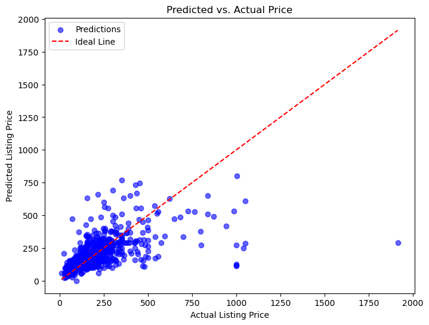

# 🏡 Airbnb Price Prediction Analysis

This project analyzes Airbnb listings data to predict property prices using **LightGBM** and various data analysis techniques.

The dataset is collected from (https://insideairbnb.com/)

---

## Project Overview

### **Airbnb Business Model**
- Airbnb is an online platform connecting hosts and travelers for short-term rentals.
- Hosts can list their properties, and guests can book accommodations worldwide.
- Revenue is generated via commission fees from both hosts and guests.

### **Business Problem**
- New hosts often struggle to determine an optimal price for their listing.
- Renters need to balance affordability with quality while choosing accommodations.

---

## **Data Exploration & Cleaning**
- **Listings dataset**: Contains property details such as price, number of rooms, and reviews.
- **Reviews dataset**: Contains guest reviews and ratings.

**Data Cleaning:**
- Removed missing values and standardized price formats.
- Filtered out extreme values (e.g., unrealistic minimum stay requirements).
- Dropped non-numeric columns for correlation analysis.

---

## **Data Analysis & Visualizations**

### **1️⃣ Price Distribution**
Understanding how Airbnb prices are distributed.

---

### **2️⃣ Correlation Matrix**
Identifying relationships between numerical features.

---

### **3️⃣ Number of Listings by Bedroom Count**
Examining supply based on the number of bedrooms.

---

### **4️⃣ Revenue by Neighborhood**
Finding the most profitable locations.

---

## **Model Training & Evaluation**
- Used **LightGBM** for training a regression model.
- Features included:
  - `bathrooms`, `bedrooms`, `beds`, `accommodates`, `minimum_nights`
- Split data: **80% train, 20% test**.

### **Model Performance:**
| Metric | Value |
|--------|------:|
| **MAE** (Mean Absolute Error) | 56.61 |
| **MSE** (Mean Squared Error) | 12648.08 |
| **R² Score** | 0.385 |

---

### **5️⃣ Model Predictions vs. Actual Prices**
Visualizing prediction accuracy.

---

## **Key Insights**
- **Longer minimum stay requirements tend to yield higher revenues.**  
- **One-bedroom listings dominate the market but might face higher competition.**  
- **Location plays a key role in revenue generation.**  
- **Price predictions can be improved with more detailed feature engineering.**  

---

## **Next Steps**
- Try adding additional features (e.g., amenities, host response time).
- Experiment with **different machine learning models** to improve accuracy.
- Incorporate **time-based trends** (e.g., seasonal demand).

---